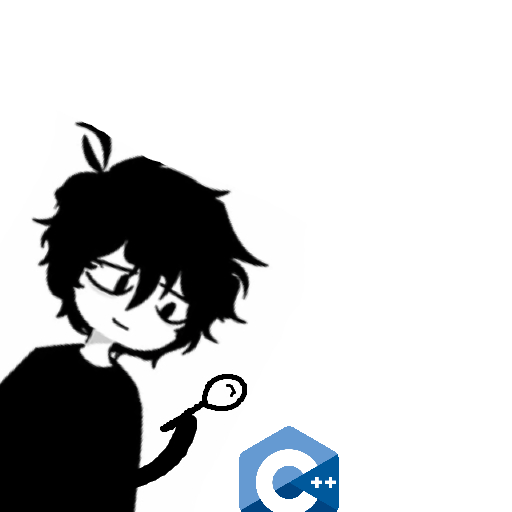

  <i>My C++ Learning Journey</i>

  

## Motivation
My main goal is to do system programming. I wonder why I had never touched this language until this moment, but instead programmed in pure assembly. 

## Current progress
For now, I've decided that the funnest way to learn is through making small terminal games, but it's not my primary goal as you know.

- [x] Learning the basics (input/output, variables, type casting, if/else blocks, switch/case blocks, etc..)
- [x] Pointers
- [x] Strings
- [x] Structs, enums
- [x] Functions (pass by value, by reference, passing functions, overloading, etc..)
- [x] Smart pointers
- [x] Templates
- [ ] OOP (50%)
- [ ] STL
- [ ] Exception handling
- [ ] Algorithms
- [ ] Multithreading
- [ ] Standard library

**_..I guess, this list will get updated later on_**
